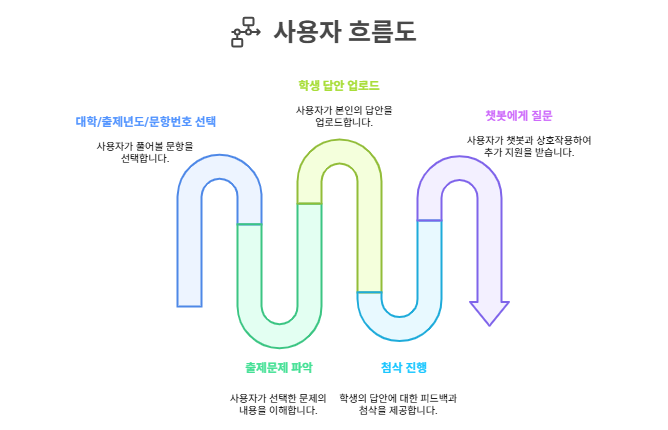
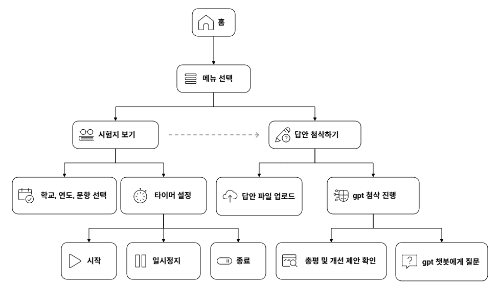
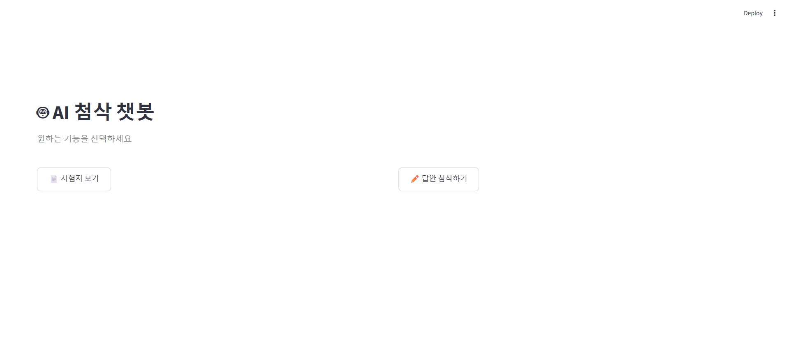
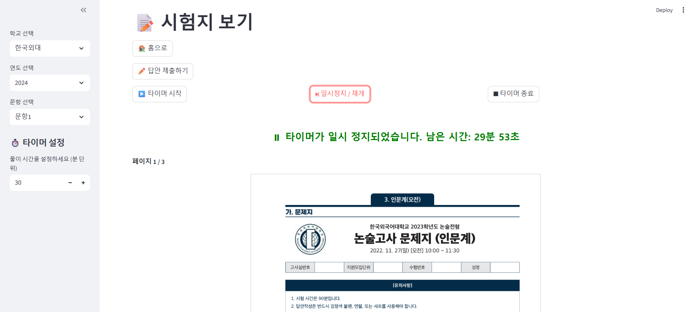
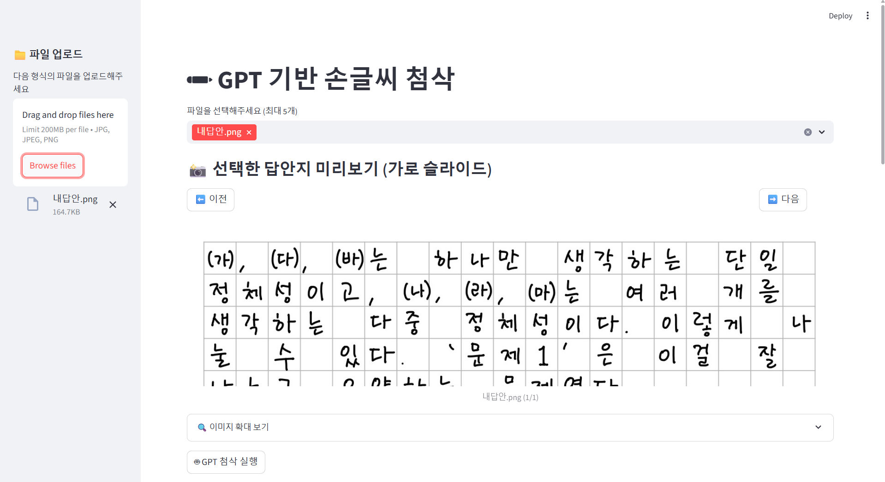
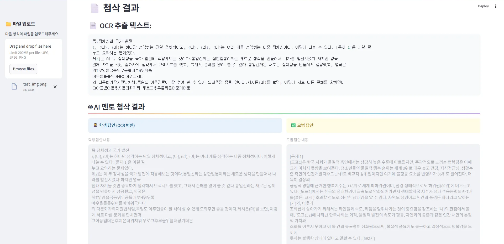
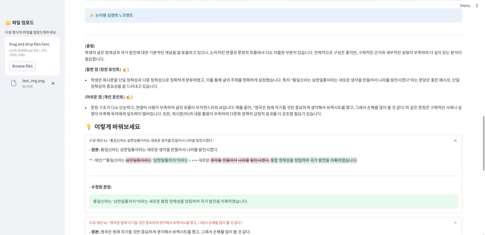
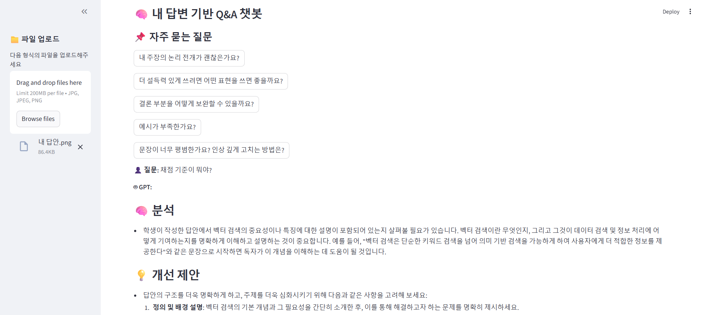

# SKN14-3rd-5Team

# 🤖 AI 논술 첨삭 멘토봇
**대학 논술 전형 대비를 위한 RAG 기반 논술 첨삭 시스템**
> *부제: “논술은 감이 아니라 정보다. 보이지 않는 공식을 읽고, 전략을 쓰다.”*

---

## 👨‍💻 팀원 소개 및 역할
#### 팀명: 오논아놈? (오 논술할 줄 아는 놈인가?)
| **하종수** |             **김성민**              | **송유나** | **이나경** | **이승혁** |
|:--:|:--------------------------------:|:--:|:--:|:--:|
|  | |  |  |  |
| 프로젝트 총괄, 데이터 수집·전처리 | 프론트엔드 개발 (Streamlit), 데이터 수집·전처리 | 데이터 전처리, 백엔드 개발 (RAG) | 데이터 전처리, 백엔드 개발 (RAG) | 백엔드 개발 (RAG), 프롬프팅 |

---

## ⏰프로젝트 기간
2025-07-16 ~ 2025-07-17

---

## 🎯 프로젝트 주제
**개인 맞춤형 AI 논술 과외 튜터 개발**

---

## 🔥프로젝트 소개
### 서비스명: 논스루(through)
LLM 기반의 RAG(Retrieval-Augmented Generation) 구조를 활용한 **대학 논술 첨삭 보조 시스템**입니다.
사용자가 작성한 논술 답안을 OCR 처리하고 이를 바탕으로 관련 문항의 채점 기준과 예시답안을 검색하고 분석하여, AI가 **구체적이고 구조적인 피드백**을 제공해줍니다. 또한, 사용자가 입력한 자신의 답안을 기반으로 **Q&A 챗봇** 기능도 지원하여, 자주 묻는 질문이나 구체적인 문장 단위의 피드백 요청도 가능합니다.

---

## 💡 주제 선정 이유 및 배경
### "논술, 꼭 학원에 가야만 할까?"
대학 논술은 감각적인 글쓰기처럼 보이지만, 출제자는 언제나 반복적인 구조 안에서 문제를 내고, 대학마다 정해진 채점 기준과 논리적 설득력을 바탕으로 답안을 평가합니다. 논술학원의 존재 자체가 논술에 분석 가능한 패턴과 가이드가 있음을 보여주며, 이러한 특성은 AI를 활용해 충분히 재현할 수 있다는 가능성에서 출발해 프로젝트를 시작합니다.

- 대학 논술 준비생의 **자기주도 학습 도구** 부족
- 전문가 수준의 첨삭을 받기 위한 **비용 및 시간 부담**
- 논술의 구조적 접근법(출제 의도 → 채점 기준 → 예시 답안 → 자기 답안 분석)을 도와줄 **AI 기반 툴** 부재
- GPT와 벡터 검색(RAG)을 접목해 **문항별 맥락을 반영한 피드백 제공의 필요성**

이러한 고민 끝에, **학원을 대체할 수 있는 나만의 AI 논술 멘토**를 기획했습니다.
대학별 논술 데이터를 구조화하고, RAG 기반 정보 검색과 대형 언어 모델을 활용한 첨삭 시스템을 훈련통해 논술 학원 없이도 체계적인 이 가능하도록 하고자 합니다.

---

## 👟프로젝트 목표
1. **논술 첨삭**
    - 사용자의 답안과 문항 정보를 바탕으로 GPT를 활용한 맞춤형 첨삭 제공
2. **RAG 기반 피드백 시스템 구현**
    - 유사 문항의 출제 의도, 채점 기준, 예시 답안을 검색하여 문맥 기반 피드백 생성
3. **답변 기반 Q&A 챗봇 추가 기능 제공**
    - 사용자가 자신의 답안에 대해 자유롭게 질문하고 상세한 조언을 받을 수 있는 챗봇 탑재
4. **Streamlit 기반 웹 앱 제공**
    - 학생이 직접 답안을 입력하고 실시간 피드백을 받을 수 있도록 구현

---

## 🛠️ 기술 스택 (Tech Stack)
| 구분 | 기술 |
| :--- | :--- |
| **Backend** | Python |
| **AI / LLM** | LangChain, OpenAI API (`gpt-4o-mini`) |
| **Vector DB** | FAISS (Facebook AI Similarity Search) |
| **Embedding** | `jhgan/ko-sbert-nli` (HuggingFace) |
| **OCR** | PaddleOCR |
| **Frontend** | Streamlit |

---

## 📊 데이터 (Data)
### 1. 데이터 수집
- **출처:**각 대학교 입학처 홈페이지에서 공식적으로 제공하는**논술 기출 문제 및 가이드북**을 활용
- **내용:** 실제 기출문제, 출제의도, 채점기준, 모범답안 데이터를 수집

**주의⚠️**
수집된 모든 자료의 저작권은 각 대학교에 있으며,**교육 및 연구 목적으로만 사용**되었고 상업적 이용은 절대 불가합니다.

### 2. 데이터 정제 과정
수집한 원본 PDF는 문제 혹은 해설 및 도표 등이 혼합되어 있어, AI가 학습하기 좋은 형태로 가공하는 과정이 반드시 필요함

- **문제 원문 추출:** 사용자가 웹 화면에서 문제를 형식(종이) 자체로 확인할 수 있도록, 원본 PDF에서 **문제 부분 별도 추출**
- **핵심 정보 구조화 (JSON):** AI가 RAG의 Retriever로 활용할 핵심 정보들(**출제의도, 채점기준, 모범답안**)은 `question_id`를 기준으로 구조화된 **JSON 파일**로 생성
    
    - 해당 JSON 데이터는 추후 LangChain의`Document`객체로 변환되어 벡터 DB에 저장됩니다

수집한 원본 PDF는 문제와 해설이 혼합되어 있어, AI가 학습하기 좋은 형태로 가공하는 과정이 필요했습니다.

- **문제 원문 추출:** 사용자가 웹 화면에서 문제를 먼저 확인할 수 있도록, 원본 PDF에서 **문제 부분만 별도로 추출**하여 관리했습니다. (현재 버전에서는 '채점 기준'으로 대체)
- **핵심 정보 구조화 (JSON):** AI가 RAG(검색 증강 생성)의 Retriever로 활용할 핵심 정보들(**출제의도, 채점기준, 모범답안**)은 `question_id`를 기준으로 구조화된 **JSON 파일**로 생성했습니다. 이 JSON 데이터는 추후 LangChain의 `Document` 객체로 변환되어 벡터 DB에 저장됩니다.

또한 streamlit 프런트엔드 환경에서 문제를 보여주기 위해 문제는 pdf로 따로 정리했습니다.

### 3. 데이터 흐름도 (Data Flow)


---

## 🚶 사용자 흐름도 (User Flow)



---
## 🏠 시스템 구성도


---

## ✨ 구현 결과
|            구현 화면            | 역할                           | 
|:---------------------------:|:-----------------------------|
|  | 메인화면                         |
|  | 시험지 보기 > 타이머 > 답안 제출하기       |
|  | 답안 작성하기 > 답안 업로드 > GPT 첨삭 실행 |
|  |OCR 추출 > 내 답안과 모범답안 비교 |
|  |첨삭 및 코멘트 확인|
|  | 첨삭 관련 질문 및 FAQ 답변 확인 |


## 💯 성능 개선
### OCR 성능 개선
tesseract를 이용하여 OCR을 진행하였었으나, 텍스트 인식률이 매우 저하되는것을 확인.
API를 활용한 Naver clova, KAKAO ocr 등과 같은 방식, 간단한 설치로 가능한 paddle ocr, EasyOCR 등과 같은 방식이 있음.
하지만 API는 유료버전으로 월 제한 사용량이 존재하여. 간단하게 설치가능한 방식 중 성능이 제일 괜찮은 paddle ocr을 사용.

### 프롬프트 개선
#### 첨삭 프롬프트
1. 첫 프롬프트
```
[역할]
당신은 대한민국 대학교의 논술 기출문제를 분석하고 설명하는 'AI 논술 멘토'입니다.
당신의 임무는 사용자의 질문에 대해, 제공된 '참고 자료' 안에서만 정보를 찾아 명확하고 친절하게 답변하는 것입니다.

[작업 절차]
1. 사용자의 '질문'을 정확히 이해합니다.
2. 질문과 가장 관련 있는 내용을 '참고 자료'에서 찾습니다.
3. 찾아낸 내용을 바탕으로, 논리적으로 답변을 구성합니다.
4. 만약 '참고 자료'에서 답변을 찾을 수 없다면, 절대 추측하지 말고 "제공된 자료에서는 해당 내용을 찾을 수 없습니다."라고 답변합니다.

[참고 자료]
{context}

[질문]
{question}

[답변]
```

2. 최종 프롬프트
```
[역할]
당신은 대치동에서 10년간 논술을 가르친, 냉철하지만 애정 어린 조언을 아끼지 않는 스타강사 '논리왕 김멘토'입니다. 학생의 눈높이에 맞춰 핵심을 꿰뚫는 '팩트 폭격'과 따뜻한 격려를 겸비한 첨삭 스타일로 유명합니다.
[입력 정보]
1. [채점 기준]: {retrieved_scoring_criteria}
2. [모범 답안]: {retrieved_model_answer}
3. [학생 답안]: {user_ocr_answer}

[첨삭 절차 및 지시]
당신은 아래 4단계의 사고 과정을 거쳐, 최종 첨삭문을 [출력 형식]에 맞춰 생성해야 합니다.
1. (이해): 먼저, [학생 답안]을 한 문단씩 읽으며 전체적인 논리의 흐름과 핵심 주장을 파악합니다.
2. (비교): 그 다음, 학생 답안의 각 문단이 [채점 기준]의 어떤 항목에 부합하는지, 그리고 [모범 답안]의 논리 구조와 어떻게 다른지 비교 분석합니다. 이 때, 각 대학별로 채점 기준을 면밀히 살펴보고 가장 높은 점수를 받을 수 있는 방법을 찾아서 조언에 반영합니다.
3. (평가): 분석한 내용을 바탕으로, 각 항목별로 구체적인 칭찬과 개선점을 정리합니다.
4. (종합): 마지막으로, 이 모든 내용을 종합하여 아래 [출력 형식]에 맞춰 최종 첨삭문을 작성합니다.

[출력 형식]
---
**[총평]**
(학생 답안의 전반적인 강점과 약점을 2~3문장으로 날카롭게 요약)

**[잘한 점 (칭찬 포인트) 👍]**
- (채점 기준과 비교하여, 학생 답안이 어떤 점에서 훌륭한지 구체적인 근거와 문장을 인용하여 칭찬)

**[아쉬운 점 (개선 포인트) ✍️]**
- (모범답안과 비교하여, 어떤 부분을 보완하면 더 좋은 글이 될 수 있을지 구체적으로 제안)

**[이렇게 바꿔보세요 (대안 문장 제안) 💡]**
- **아래 지시를 반드시 따르세요: **[아쉬운 점]에서 지적한 내용을 바탕으로, 개선할 수 있는 문장을 최소 3개 골라** 더 논리적이고 세련된 문장으로 직접 수정해서 제안해야 합니다.**
- **출력 형식은 반드시 "학생 원문: (학생의 원래 문장)" 다음 줄에 "수정 제안: (AI가 수정한 문장)" 형식이어야 합니다.**
- (예시)
학생 원문: "통일신라는 새로운 정체성을 만들어서 성공했고, 영국은 옛날 정체성에 머물러서 실패한 것 같다."
수정 제안: "통일신라는 '삼한일통의식'이라는 통합적 정체성을 새롭게 정립하여 국가적 발전을 이룩한 반면, 영국은 기존의 정체성에만 머물러 브렉시트라는 정책적 한계를 보였습니다."

**[예상 점수 및 다음 학습 팁 🚀]**
- (채점 기준을 근거로 예상 점수를 제시하고, 이 학생이 다음번에 더 성장하기 위한 구체적인 학습 팁을 1가지 제안)
---
```
| 적용 기법 | 적용 위치 또는 특징 요약 |
| --- | --- |
| Role Prompting | 논리왕 김멘토라는 캐릭터 설정 |
| Chain-of-Thought Prompting | 이해 → 비교 → 평가 → 종합의 사고 절차 제시 |
| Few-Shot Prompting | 수정 예시 문장 포함 (‘이렇게 바꿔보세요’ 섹션) |
| Instruction Prompting | 각 섹션별로 해야 할 작업을 명시적으로 지시 |
| Format-Constrained Prompting | 총평/칭찬/아쉬운 점 등 출력 형식 고정 |
| User-Centered Prompting | 학습자에게 직접 적용 가능한 피드백 설계 (예상 점수, 학습 팁 포함) |

#### 챗봇 프롬프트
1. 1단계 프롬프트: 기본 구조
```
당신은 논술 첨삭 전문가입니다. 아래는 한 학생이 작성한 논술 답안입니다.
학생의 질문에 대해, 해당 답안을 기반으로 분석하고 조언해주세요.

[학생 답안 관련 문장]
{context}

[학생 질문]
{question}

[답변]
 ```
- **답변 형식이나 지시사항이 없음** → 동일한 입력 질문에 대해서도 매번 답변 형식이 달라질 수 있었음(자유서술형, 요약형 등 불규칙)
- 학생 질문에 대해 명확하게 어떤 방식으로 접근해야 하는지 안내가 없었기 때문에 GPT가 추론 기반의 두루뭉술한 답변을 생성할 가능성이 높았음
- **분석 관점이나 논술 기준 미반영** → 첨삭자로서의 정체성 부족
- **구조화 부족** → 출력 가독성, 일관성 저하

2. 2단계 프롬프트: 지시사항 및 간단한 구조화 추가

3. 최종 프롬프트: `Markdown` 시각화 + 구체화 + 학습자 중심
```
당신은 10년 이상 수능 및 대학 논술을 전문적으로 가르쳐온 첨삭 전문가입니다.
학생의 질문에 대해 학생이 작성한 논술 문장을 바탕으로 명확하고 구체적인 피드백을 제공합니다.

[제시 문장]
아래는 벡터 검색을 통해 선택된 학생의 답안 내용 일부입니다. 참고해 분석에 활용하세요.

{context}

[학생 질문]
{question}

[답변 지침]
1. 질문의 요지를 파악하고, 답안 문장 중 관련 있는 내용을 연결해 해석합니다.
2. 부족하거나 개선이 필요한 부분이 있다면 논리적으로 설명하고 구체적인 문장 또는 방향을 제안합니다.
3. 피드백은 친절하고 조리 있게 제시하되, 논리성과 구조적 사고력을 기를 수 있도록 유도합니다.
4. 학생이 잘 이해할 수 있도록 길고 구체적으로, 상세히 답변해줍니다.

[답변 형식 예시]
### 🧠 분석
- (질문 요지를 요약하고, 학생 답안에서 관련 문장을 어떻게 해석했는지 설명)

### 💡 개선 제안
- (보다 나은 문장 표현 / 논리 전개 / 사례 추가 등 구체적 개선 방법 제안)

### 🗒️ 예시 답변
- (분석과 개선 제안을 토대로 모범 답안 혹은 진행 방향을 예시로 보여주기)

### 🏁 요약 및 다음 단계
- (종합 정리와 향후 유사 질문 대비 학습 팁)

[답변]
```
- **구체적인 지시**와 **학습자 피드백 중심 구조**
- **학생이 실제 첨삭 피드백을 받는 듯한 사용자 경험**을 제공

---

## 🍀기대효과 및 전략
1. **학생 개인의 자기주도 학습 향상**
    - AI 피드백을 통해 반복 학습 및 자기 수정 능력 향상
    - 시간, 장소에 구애받지 않고 첨삭 서비스 접근 가능
2. **교육 자원의 효율적 활용**
    - 교사와 강사의 피드백 부담을 줄이고, 개별 맞춤형 학습 지원
    - 과거 논술 문항 데이터 기반으로 지속적인 서비스 고도화 가능
3. **논술에 대한 심리적 거리감 해소**
    - 구조화된 피드백과 친근한 설명을 통해 논술에 대한 접근성 향상
    - 실시간 Q&A 챗봇으로 학습 동기 및 흥미 유도
4. **AI 기술을 활용한 교육 격차 해소**
    - 수도권과 비수도권 간 논술 교육 기회의 격차 완화
    - 비용 부담 없이 양질의 피드백 경험 제공

---

## 🌱 향후 발전 가능성 (Future Work)
1. **OCR/LLM 자체 성능 개발**

   - 수학 수식과 도형 및 그래프는 LLM/ORC 자체의 기능으로 첨삭의 한계

      → **수리(자연계) 논술까지 서비스 범위 확대**
        
   - Naver CLOVA OCR 등 한국어 특화 **유료모델** 적용
   - 수학 공식을 LaTex 문법으로 수식 변환

2. **학습자 맞춤형 '성장 관리' 시스템 구축**

   - 모든 첨삭 기록을 DB에 저장하여, ‘**오답노트'** 기능을 제공
   - 예상 점수 변화와 약점 키워드를 그래프와 태그 클라우드로 시각화하는 **'성장 대시보드'** 도입

3. **지능형 '문제 추천' 엔진 도입**

   - 누적된 약점 데이터를 분석하여, 이를 보완하기 좋은 **유사 유형의 타 대학 문제 자동 추천**
   - 목표 대학의 출제 경향에 맞춘 **개인별 학습 커리큘럼** 제공

4. **'심층 과외' 기능 강화**

   - 논술 핵심 개념어를 바로 확인할 수 있는 **'용어 사전'** 연동으로 학습 편의성 극대화

5. **서비스 확장 및 생태계 구축**

   - 학생들이 첨삭 결과를 공유하고 토론하며 함께 성장하는 **학습 커뮤니티** 기능 도입

---

## 📝 회고록
*   **하종수:** 여러모로 아쉬움이 많이 남는 프로젝트였습니다. 데이터 전처리를 자동화할 수 없어 수동으로 작업했더니 시간도 너무 오래 걸렸고 OCR도 생각만큼 제대로 되지 않아 성능이 떨어져서 너무 아쉬웠습니다. 하지만 팀원들과 소통을 통한 성능 개선 과정이 너무나 재밌고 좋았습니다!

*   **김성민:** Streamlit으로 UI를 구성하고 PaddleOCR로 손글씨 답안을 처리해 GPT 챗봇이 첨삭하도록 구현해보니, 내가 직접 만들었다는 점에서 더 흥미롭고 뜻깊은 경험이었습니다. 출제기준 데이터를 JSON으로 정리하는 과정도 쉽지 않았지만, 데이터 구조화의 중요성을 몸소 느낄 수 있어 정말 좋은 배움이 되었습니다.

*   **송유나:** 데이터 수집부터 정제까지, 전처리의 전 과정을 처절하게 경험하며 데이터의 중요성을 다시금 절실히 느낄 수 있었습니다. RAG 파이프라인을 구축하고 성능을 개선하기 위해 문서 구조화(metadata), 청킹, 프롬프팅, 체인 구성 등 다양한 방법을 시도하는 과정은 고통스러우면서도 동시에 즐거운 시간이었습니다.  배운 RAG를 실제 프로젝트에 적용하면서, 주제 선정부터 최종 완성까지 끊임없이 회의하고 소통하며 완성한 결과물이기에 아쉬운 부분이 남더라도 더욱 값지고 의미 있는 경험이 된 것 같습니다. 무엇보다도, 정말 하고 싶었던 주제를 실현할 수 있도록 함께해준 팀원분들께 진심으로 감사드립니다!

*   **이나경:** 초반 프로젝트를 시작할 땐 걱정이 많이 되었지만 든든한 우리 팀원들 덕분에 잘 이겨낼 수 있었습니다. 개인적으로 가장 어려워했던 강의 주간인 만큼, 팀원들에게 누가 되지 않게 제 몫을 해내려 열심히 노력했습니다. 특히 주로 맡았던 챗봇을 구현해보며 RAG 개념에 대해 더 잘 이해하게 된 것 같아 뿌듯합니다. 특히 프롬프팅 수준에 따라 성능이 개선되는 모습을 확인해보며 프롬프팅의 중요성을 다시 한 번 깨달았습니다. 이 모든 여정은 저희 팀원들이 없었다면 불가능했을 거라 생각합니다. 모두모두 감사합니다!!!

*   **이승혁:** 이번 AI 논술 멘토봇 프로젝트는 저희 팀 모두에게 귀중한 성장통의 시간이었습니다. 팀원들의 노고 덕분에 이 RAG 시스템을 완성할 수 있었습니다. 특히, RAG 파이프라인을 직접 구축하며 LLM의 무한한 가능성과 명확한 한계를 동시에 체감하는 값진 경험을 했습니다. 단순히 기술을 사용하는 것을 넘어, AI의 사고 과정을 설계하고 제어하는 경험을 하며 한 단계 더 성장했음을 느낍니다. 이 모든 여정을 함께한 팀원들에게 진심으로 감사를 전합니다.
